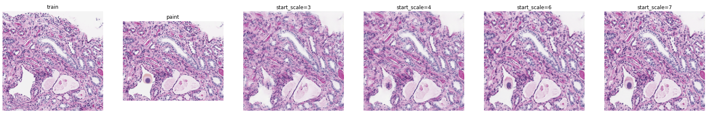
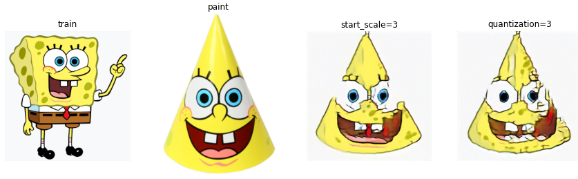

# sinGAN reload

sinGAN reload is a PyTorch reimplementation of the paper "SinGAN: Learning a Generative Model from a Single Natural Image" (ICCV 2019, [Arxiv](https://arxiv.org/pdf/1905.01164.pdf)). It enables users to transfer a paint into a realistic image.

We intend to re-implement the paint-to-image task from SinGan, and extend the application to digital pathology use case. Furthermore, we aim to provide a user-friendly frontend platform for the above mentioned image manipulation tasks.






## Get Started

Run the following command to install dependencies.
```bash
pip install -r requirements.txt
```
